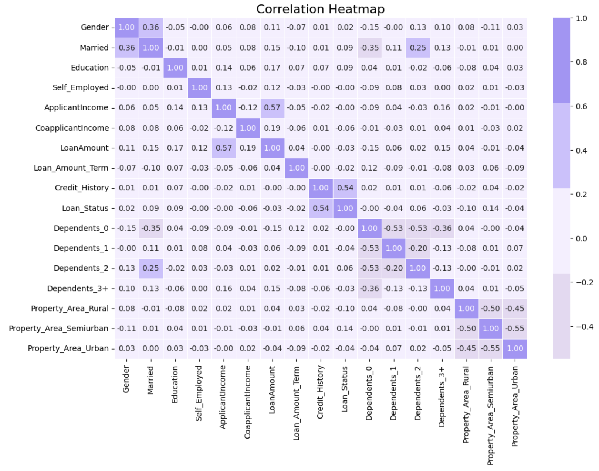
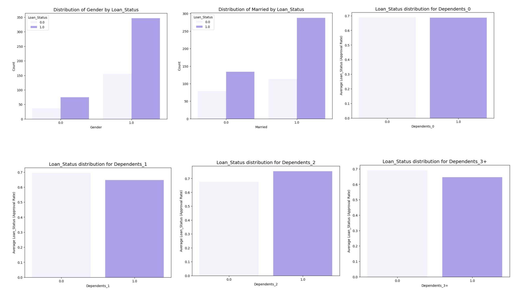
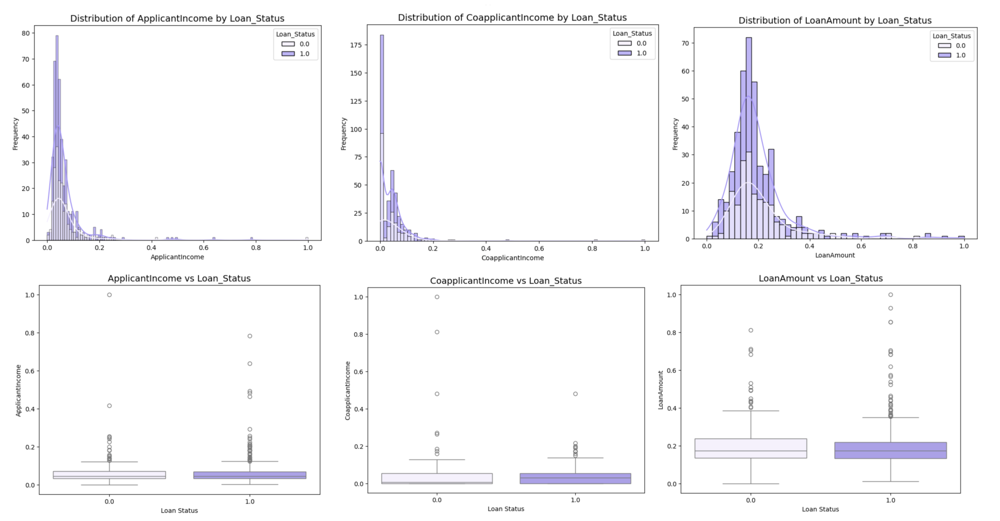
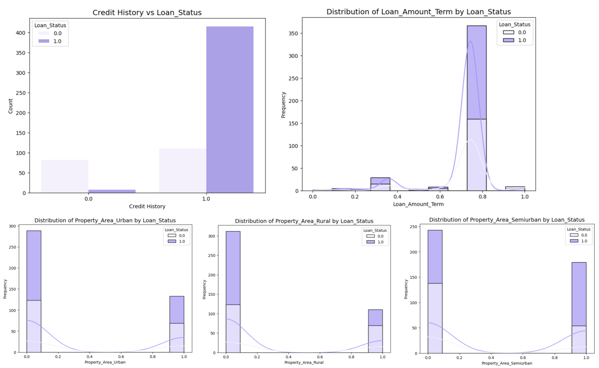
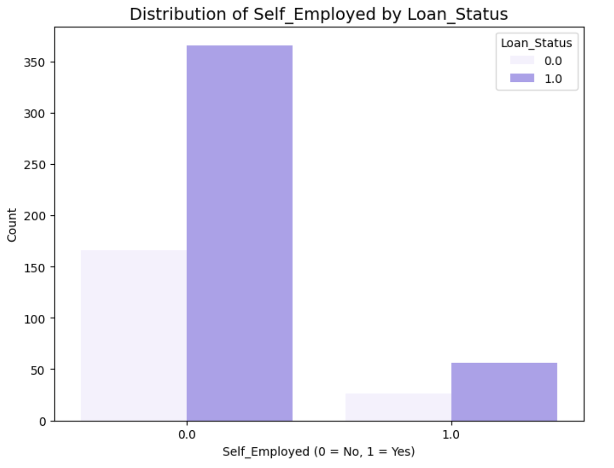
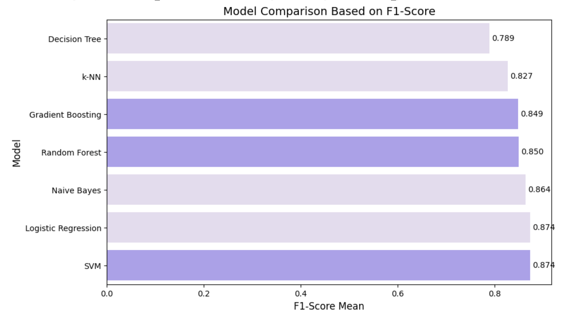
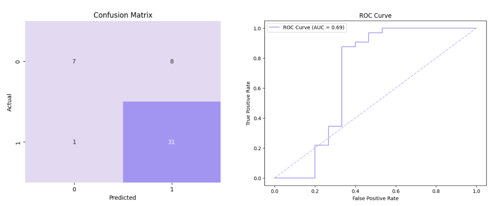

# Credit Risk Classification


## Challenge Description

Dream Housing Finance là một công ty tài chính chuyên cung cấp các khoản vay mua nhà. Công ty hoạt động trên khắp các khu vực đô thị, bán đô thị và nông thôn. Hiện tại, quy trình xét duyệt khoản vay dựa vào nhân viên và mất nhiều thời gian. Vì vậy, mục tiêu là tự động hóa quy trình xét duyệt bằng cách xây dựng một mô hình dự đoán khả năng khách hàng được chấp thuận khoản vay. Điều này sẽ giúp công ty tập trung vào các khách hàng tiềm năng.

## Workflow stages
Solution được thực hiện qua 7 bước sau:

1. Problem definition.
2. Acquire data.
3. Wrangle, prepare, cleanse the data.
4. Analyze, identify patterns, and explore the data.
5. Model, predict and solve the problem.
6. Visualize, report, and present the problem solving steps and final solution.
7. Supply or submit the results.

## Dataset Information

Bộ dữ liệu chứa các thông tin nhân khẩu học và lịch sử vay vốn của những khách hàng trước đây của công ty.

Attribute Information:

1. Loan_ID: Unique Loan ID
2. Gender: Male/ Female
3. Married: Applicant married status (Y/N)
4. Dependents: Number of dependents
5. Education: Applicant Education (Graduate/ Under Graduate)
6. Self_Employed: Self-employed (Y/N)
7. ApplicantIncome: Applicant income
8. CoapplicantIncome: Coapplicant income
9. LoanAmount: Loan amount in thousands
10. Loan_Amount_Term: Term of a loan in months
11. Credit_History: credit history meets guidelines
12. Property_Area: Urban / Semi-Urban / Rural
13. Loan_Status: Loan approved (Y/N)
    
# **1. Xác định vấn đề**
Dream Housing Finance muốn tự động hóa quy trình xét duyệt khoản vay dựa trên thông tin khách hàng. Mục tiêu của bài toán là xây dựng một mô hình dự đoán xem khách hàng có được duyệt khoản vay hay không.

**Xác định biến mục tiêu:**


- **Biến mục tiêu (target variable):** là biến muốn dự đoán hoặc giải thích dựa trên các biến đầu vào (biến độc lập hoặc đặc trưng - features).
- Biến mục tiêu của mô hình dự đoán nhóm xây dựng là: **Loan_Status**

# **2. Thu thập và tiền xử lý dữ liệu**

- **Nhập dữ liệu** từ file CSV chứa thông tin về các khoản vay.
- **Chuyển đổi dữ liệu**: Đặt `Loan_ID` làm chỉ mục thay vì giữ nguyên dạng cột.
- **Phân loại biến**:
  - **Categorical (Phân loại)**:
    - **Nominal (Không có thứ tự)**: Giới tính, tình trạng hôn nhân, nghề nghiệp tự do, khu vực tài sản, trạng thái khoản vay.
    - **Ordinal (Có thứ tự)**: Trình độ học vấn, số lượng người phụ thuộc.
  - **Numerical (Số liệu)**:
    - **Continuous (Liên tục)**: Thu nhập của người vay, thu nhập của người đồng vay, số tiền vay.
    - **Discrete (Rời rạc)**: Thời hạn vay, lịch sử tín dụng.
- **Xử lý dữ liệu bị thiếu**:
  - **Xác định các cột có giá trị NULL** và kiểm tra phân phối dữ liệu.
  - **Điền dữ liệu thiếu**:
    - Các biến phân loại được điền bằng **giá trị phổ biến nhất (mode)**.
    - Các biến số được điền bằng **trung vị (median)** do không tuân theo phân phối chuẩn.

# **3. Làm sạch dữ liệu (Data Wrangling)**
- **Xử lý dữ liệu phân loại (Categorical)**
  - Chuyển đổi trạng thái khoản vay (`Loan_Status`) thành **0 và 1** (Từ chối/Chấp thuận).
  - Mã hóa biến **giới tính, trình độ học vấn, tình trạng hôn nhân, nghề nghiệp tự do** thành nhị phân (0/1).
  - Áp dụng **One-Hot Encoding** cho các biến có nhiều hơn hai giá trị (số người phụ thuộc, khu vực tài sản).
- **Chuẩn hóa dữ liệu số (Numerical)**
  - Dùng **MinMaxScaler** để đưa các giá trị về phạm vi (0,1) giúp mô hình hoạt động hiệu quả hơn.

==> Dữ liệu đã được **làm sạch và chuẩn hóa**, sẵn sàng để xây dựng mô hình dự đoán.

# **4. Phân tích dữ liệu khám phá (EDA)**

## **4.1. Phân tích mối quan hệ giữa các biến (Correlation Heatmap)**

- **Mục tiêu**: Xác định biến nào có ảnh hưởng mạnh đến quyết định chấp thuận khoản vay.



- **Kết quả chính**:
  - **Credit_History** có mối tương quan mạnh nhất với **Loan_Status**, cho thấy lịch sử tín dụng là yếu tố quan trọng nhất.
  - **LoanAmount** và **ApplicantIncome** có tương quan trung bình, hợp lý vì thu nhập cao hơn thường liên quan đến khoản vay lớn hơn.
  - Một số biến như **Gender**, **Self_Employed**, và **Dependents** có tương quan yếu với **Loan_Status**, cho thấy ảnh hưởng không đáng kể.

## **4.2. Phân tích phân phối dữ liệu (Distribution Analysis)**

### **1. Biến nhân khẩu học (Demographic Variables)**
- **Mục tiêu**: Kiểm tra xem giới tính, tình trạng hôn nhân và số người phụ thuộc ảnh hưởng thế nào đến quyết định vay.



- **Kết quả**:
  - **Married**: Người đã kết hôn có tỷ lệ được chấp thuận cao hơn.
  - **Dependents**: Nhóm không có người phụ thuộc có tỷ lệ chấp thuận cao nhất.
  - **Gender**: Không có tác động rõ ràng đến tỷ lệ chấp thuận.
- **Kết luận**:
  - **Giữ lại**: Married, Dependents.
  - **Loại bỏ**: Gender (không có ý nghĩa dự báo).

### **2. Biến tài chính (Financial Variables)**
- **Mục tiêu**: Đánh giá thu nhập và số tiền vay có ảnh hưởng đến quyết định chấp thuận không.



- **Kết quả**:
  - **ApplicantIncome**: Thu nhập cao không đảm bảo được chấp thuận khoản vay, nhưng thu nhập trung bình có tỷ lệ chấp thuận cao hơn.
  - **LoanAmount**: Số tiền vay có ảnh hưởng nhưng có thể phụ thuộc vào lịch sử tín dụng.
  - **CoapplicantIncome**: Không có ảnh hưởng đáng kể đến quyết định.
- **Kết luận**:
  - **Giữ lại**: ApplicantIncome, LoanAmount.
  - **Loại bỏ**: CoapplicantIncome.

### **3. Lịch sử tín dụng và thông tin khoản vay**
- **Mục tiêu**: Xác định tác động của lịch sử tín dụng và thông tin khoản vay.



- **Kết quả**:
  - **Credit_History**:
    - Nhóm có lịch sử tín dụng tốt (**1.0**) có tỷ lệ chấp thuận rất cao.
    - Nhóm có lịch sử tín dụng xấu (**0.0**) có tỷ lệ từ chối cao.
  - **Loan_Amount_Term**:
    - Hầu hết các khoản vay có thời hạn chuẩn (360 tháng).
    - Không có sự khác biệt đáng kể về tỷ lệ chấp thuận theo thời hạn vay.
  - **Property_Area**:
    - **Semiurban** có tỷ lệ chấp thuận cao nhất.
    - **Rural** có tỷ lệ bị từ chối cao nhất.
    - **Urban** có tỷ lệ cân bằng.
- **Kết luận**:
  - **Giữ lại**: Credit_History, Property_Area.
  - **Loại bỏ**: Loan_Amount_Term.

### **4. Biến Self_Employed**
- **Mục tiêu**: Xem xét ảnh hưởng của nghề nghiệp tự doanh đến tỷ lệ chấp thuận khoản vay.




- **Kết quả**:
  - **Không tự kinh doanh**: Chiếm đa số và có tỷ lệ được chấp thuận cao hơn.
  - **Tự kinh doanh**: Tỷ lệ chấp thuận thấp hơn, có thể do đánh giá rủi ro cao hơn.
- **Kết luận**:
  - **Giữ lại**: Self_Employed (có tác động rõ ràng đến tỷ lệ chấp thuận).

## **4.3. Loại bỏ các biến không quan trọng**
- **Loại bỏ**: Loan_Amount_Term, CoapplicantIncome, Gender do không ảnh hưởng đáng kể đến quyết định chấp thuận khoản vay.
# **5. Phát triển mô hình (Model Development)**

## **5.1. Chia tập dữ liệu (Dataset Splitting)**

- **Tỉ lệ chia:** 90% train, 2.5% validation, 7.5% test.
- **Mục tiêu:** Đảm bảo có đủ dữ liệu để huấn luyện và đánh giá mô hình một cách công bằng.
- **Cách thực hiện:**
  1. Chia dữ liệu thành **train+validation (92.5%)** và **test (7.5%)**.
  2. Chia tiếp **train+validation** thành **train (90%)** và **validation (2.5%)**.

## **5.2. Lựa chọn mô hình (Model Selection)**

### **Bài toán đặt ra:**
- Đây là bài toán **phân loại nhị phân (binary classification)** nhằm dự đoán khả năng được duyệt khoản vay (`Loan_Status`).
- Các mô hình tiềm năng:
  - **Logistic Regression** (Mô hình cơ bản, dễ diễn giải).
  - **Decision Tree** (Dễ hiểu nhưng dễ overfitting).
  - **Random Forest** (Giảm overfitting bằng cách kết hợp nhiều cây quyết định).
  - **Gradient Boosting** (Tối ưu hóa hiệu suất dự đoán).
  - **Naive Bayes** (Nhanh, đáng tin cậy trong một số trường hợp).
  - **KNN** (Xác định kết quả dựa trên điểm gần nhất).
  - **SVM** (Mô hình mạnh mẽ, khả năng thích ứng cao).

## **5.3. Chọn đặc trưng đầu vào (Selected Features)**

- **Numerical Variables:**
  - `ApplicantIncome`
  - `LoanAmount`
  - `Credit_History`
- **Categorical Variables (One-Hot Encoded):**
  - `Married`, `Education`, `Self_Employed`
  - `Dependents_0`, `Dependents_1`, `Dependents_2`, `Dependents_3+`
  - `Property_Area_Rural`, `Property_Area_Semiurban`, `Property_Area_Urban`
- **Target Variable:** `Loan_Status`

## **5.4. Huấn luyện mô hình ban đầu (Baseline Model: Logistic Regression)**

- **Mục tiêu:** Đánh giá xem mô hình cơ bản có thể đạt hiệu suất tốt không trước khi thử nghiệm các mô hình phức tạp hơn.
- **Kết quả đánh giá trên tập validation:**
  - **F1-Score:** 0.8511
  - **Recall:** 0.9524
  - **ROC-AUC:** 0.7128

- **Nhận xét:**
  - Hiệu suất khá tốt, nhưng mô hình có dấu hiệu mất cân bằng (ưu tiên nhóm "Approved").
  - Cần cải thiện khả năng nhận diện nhóm "Not Approved" bằng cách xử lý mất cân bằng dữ liệu.

## **5.5. Xử lý cân bằng dữ liệu (Handling Class Imbalance)**

- **Phương pháp sử dụng:** **SMOTE (Synthetic Minority Over-sampling Technique)**
- **Lợi ích:**
  - Tăng dữ liệu cho nhóm thiểu số bằng cách tạo dữ liệu mới từ các điểm dữ liệu hiện có.
  - Giúp mô hình học được nhiều đặc trưng hơn về nhóm "Not Approved".
  - Giảm nguy cơ overfitting so với việc sao chép dữ liệu.

## **5.6. Đánh giá mô hình bằng Cross-Validation**

- **Thực hiện 5-fold cross-validation** để đánh giá 7 mô hình:
  - **Tiêu chí đánh giá:** F1-Score và ROC-AUC.
  


  - **Kết quả:**
    - **F1-Score cao nhất:** **SVM (0.861)**
    - **ROC-AUC cao nhất:** **Random Forest (0.776)**
- **Kết luận:** **SVM được chọn** vì có **F1-Score cao nhất**, đảm bảo cân bằng giữa Precision và Recall.

## **5.7. Tối ưu hóa mô hình (Hyperparameter Tuning for SVM)**

- **Sử dụng RandomizedSearchCV để tìm tham số tối ưu:**
  - `C`: Độ chặt chẽ của mô hình.
  - `gamma`: Phạm vi ảnh hưởng của điểm dữ liệu.
  - `kernel`: Hàm biến đổi dữ liệu.

- **Kết quả sau tuning trên tập validation:**
  - **F1-Score:** Cải thiện đáng kể.
  - **ROC-AUC:** Tăng từ **0.7128 → 0.8017**.
  - **Recall lớp "Not Approved"** cải thiện rõ rệt.

## **5.8. Đánh giá trên tập test (Final Model Evaluation on Test Set)**



- **Kết quả trên tập test:**
  - **Accuracy:** 0.8415
  - **Precision:** 0.8112
  - **Recall:** 0.9767 (tốt cho nhóm "Approved", nhưng nhóm "Not Approved" vẫn cần cải thiện).
  - **F1-Score:** 0.8665
  - **ROC-AUC:** 0.7834

- **Nhận xét:**
  - **Lớp "Approved" được nhận diện tốt (Recall cao).**
  - **Lớp "Not Approved" vẫn bị phân loại nhầm một số trường hợp.**
  - **Giải pháp khắc phục:** Điều chỉnh ngưỡng dự đoán hoặc thử nghiệm các mô hình ensemble.

## **5.9. Kết luận và hướng phát triển**

- **Mô hình SVM** được chọn với hiệu suất cao nhất, đảm bảo cân bằng Precision & Recall.
- **Có thể cải thiện thêm bằng cách:**
  - Tối ưu hóa đặc trưng đầu vào (feature engineering).
  - Kết hợp nhiều mô hình (ensemble models).
  - Điều chỉnh ngưỡng phân loại để giảm sai số trên nhóm "Not Approved".

- **Lưu mô hình:**  
```python
import joblib
joblib.dump(best_model, "best_model.pkl")
print("Best model saved successfully.")


